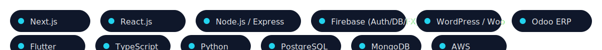

<!-- Profile README for Sabbam Chandraneel -->

  

  

  <a href="mailto:sabbam2004@gmail.com">📧 sabbam2004@gmail.com</a> •
  <a href="https://www.linkedin.com/in/sabbam-chandraneel/">LinkedIn</a> •
  <a href="https://neelportfolio.in">Portfolio</a>

 

<!-- Unique tech badges (custom SVG, no external services) -->

  

---

### About Me
I design and ship **cloud-native products**, **high-performance WordPress platforms**, **Odoo ERP modules**, and **mobile apps**. I care about clean code, Core Web Vitals, CI/CD, and measurable outcomes.

**Focus areas:** Next.js/React · Node/Express · Firebase (Auth/Firestore/Functions) · WordPress/Woo · Odoo ERP · Flutter · AWS

---

### Featured Projects — Grid View
<!-- Card grid built with HTML+inline styles for a distinctive, boxed layout -->
<table width="100%">
  <tr>
    <td width="50%" style="vertical-align:top;padding:12px;">
      

        <h3 style="margin:0 0 6px 0;">Digisoft AI (WordPress)</h3>
        
Corporate site with SEO-first build, caching/CDN, CWV optimization.

        
Stack: WordPress, custom plugins/themes, WP-CLI, CI/CD

        <a href="https://digisoftai.com/">🔗 digisoftai.com</a>
      

    </td>
    <td width="50%" style="vertical-align:top;padding:12px;">
      

        <h3 style="margin:0 0 6px 0;">IntellifluxAI (WordPress)</h3>
        
Responsive information architecture, fast TTFB, optimized assets.

        
Stack: WordPress, Gutenberg, Perf/SEO, Cloudflare

        <a href="https://intellifluxai.com/">🔗 intellifluxai.com</a>
      

    </td>
  </tr>
  <tr>
    <td width="50%" style="vertical-align:top;padding:12px;">
      

        <h3 style="margin:0 0 6px 0;">Vizag IAS Academy (WordPress)</h3>
        
Academic portal architecture with growth-ready content model.

        
Stack: WordPress, Woo, Multisite-ready, SEO

        <a href="https://vizagiasacademy.com/">🔗 vizagiasacademy.com</a>
      

    </td>
    <td width="50%" style="vertical-align:top;padding:12px;">
      

        <h3 style="margin:0 0 6px 0;">Kaalishakthi Peetham (WordPress)</h3>
        
Events & donations with uptime-first rollout and backup strategy.

        
Stack: WordPress, Woo, Payment, Security Hardening

        <a href="https://kaalishakthipeetham.com/">🔗 kaalishakthipeetham.com</a>
      

    </td>
  </tr>
  <tr>
    <td width="50%" style="vertical-align:top;padding:12px;">
      

        <h3 style="margin:0 0 6px 0;">Perhit Siksha (WordPress)</h3>
        
Education nonprofit platform with structured content & SEO.

        
Stack: WordPress, Custom Theme, SEO Audits

        <a href="https://perhitsiksha.org/">🔗 perhitsiksha.org</a>
      

    </td>
    <td width="50%" style="vertical-align:top;padding:12px;">
      

        <h3 style="margin:0 0 6px 0;">AI EdTech Platform (SaaS)</h3>
        
Adaptive learning + analytics + GenAI content.

        
Stack: Next.js, Firebase, GenAI APIs

        Repo: make public & pin
      

    </td>
  </tr>
  <tr>
    <td width="50%" style="vertical-align:top;padding:12px;">
      

        <h3 style="margin:0 0 6px 0;">Odoo ERP Modules (Suite)</h3>
        
Commission, Vendor Signup, Email Verify, PWA, Multi-Company Controls.

        
Stack: Odoo (Python), PostgreSQL, Integrations

        Repo: publish suite overview & pin
      

    </td>
    <td width="50%" style="vertical-align:top;padding:12px;">
      

        <h3 style="margin:0 0 6px 0;">WCM Ministry App (Mobile)</h3>
        
Content + events + notifications.

        
Stack: Flutter, Firebase

        Repo: add screenshots & pin
      

    </td>
  </tr>
</table>

---

### Live Stats (with fallback)

  

  

  

If any image fails to load (rare), your README still looks unique due to the banner, animated headline, custom tech badges, and boxed grid.

---

### Contact
**Email:** sabbam2004@gmail.com · **LinkedIn:** https://www.linkedin.com/in/sabbam-chandraneel/ · **Portfolio:** https://neelportfolio.in

Timezone: Asia/Kolkata • Last updated: 2025-08-24
