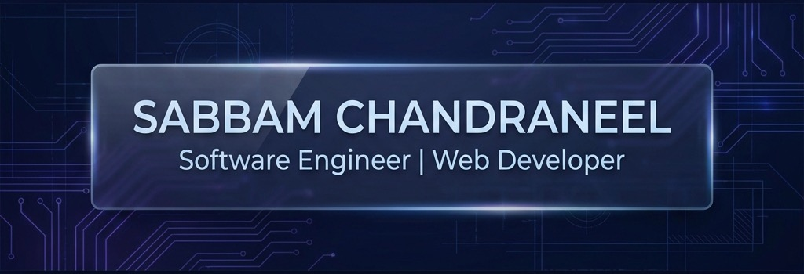

  

  

---

<table border="0" cellpadding="0" cellspacing="0" width="100%">
  <tr>
    <td width="30%" align="center" style="background:#0D1117; border: 1px solid #232946; border-radius: 10px; padding: 20px;">
      <h3 style="color:#6366F1;">PROFILE INFO</h3>
      

        <b>Role:</b> Software Engineer 
        <b>Focus:</b> Web Development 
        <b>Specialty:</b> Full-Stack & AI 
        <b>Location:</b> Visakhapatnam, IN 
      

      

      

        
        
        
      

    </td>
    <td width="5%"></td>
    <td width="65%" style="vertical-align: top;">
      <h2 style="color:#4F46E5;"></h2>
      

        I am a <b>Software Engineer & Web Developer</b> with hands-on experience in designing, building, and maintaining scalable ecosystems. From robust Java/Python backends to fluid React Native/Flutter interfaces, I own the full software development lifecycle. My expertise lies in translating complex business requirements into high-performance technical solutions that scale.
      

       
      

        
        
        
      

    </td>
  </tr>
</table>

 

## 

  <table border="0" cellpadding="10" cellspacing="0">
    <tr>
      <td align="center"><b>PROGRAMMING</b> </td>
      <td width="20"></td>
      <td align="center"><b>FRONTEND</b> </td>
    </tr>
    <tr>
      <td align="center"><b>BACKEND & DB</b> </td>
      <td width="20"></td>
      <td align="center"><b>MOBILE DEV</b> </td>
    </tr>
    <tr>
      <td align="center"><b>CMS & ERP</b> 
      
      
      
      </td>
      <td width="20"></td>
      <td align="center"><b>ENGINEERING TOOLS</b> </td>
    </tr>
  </table>
   
  
<i>Specialized in: <b>High-Performance Web & Mobile Systems</b> • <b>B2B Logic Automation</b> • <b>AI-Driven Data Insights</b></i>

 

## 

<table border="0" cellpadding="0" cellspacing="10" width="100%">
  <tr>
    <td width="50%" align="left" style="background:#131A36; padding: 20px; border-radius: 12px; border-left: 4px solid #6366F1;">
      <h3 style="color:#6366F1; margin:0;"> WCM CHURCH MINISTRY</h3>
      
Production-grade Flutter application with Firebase backend. Features role-based access, event bookings, and payment workflows.

    </td>
    <td width="50%" align="left" style="background:#131A36; padding: 20px; border-radius: 12px; border-left: 4px solid #4F46E5;">
      <h3 style="color:#4F46E5; margin:0;"> AI FINANCE MANAGER</h3>
      
Cross-platform Expo/Firebase app integrating Google Gemini for intelligent financial analysis and Streamlit dashboards.

    </td>
  </tr>
  <tr>
    <td width="50%" align="left" style="background:#131A36; padding: 20px; border-radius: 12px; border-left: 4px solid #6366F1;">
      <h3 style="color:#6366F1; margin:0;"> AI TRAVEL PLANNER</h3>
      
AI-powered system generating personalized itineraries with profile-based persistence and PDF export functionality.

    </td>
    <td width="50%" align="left" style="background:#131A36; padding: 20px; border-radius: 12px; border-left: 4px solid #4F46E5;">
      <h3 style="color:#4F46E5; margin:0;"> MY SECURE</h3>
      
Security utility for generating strong credentials using entropy analysis. Built with React for zero-knowledge client-side safety.

    </td>
  </tr>
</table>

 

## 

### 🚀 Aixor Digital | Web Developer 
*Sep 2025 – Present*
- Delivered **10+ production-grade WordPress and Shopify platforms** focused on B2B performance.
- Customized complex **WooCommerce workflows** and security-hardened deployment pipelines.
- Managed end-to-end deployments, security updates, and post-launch site maintenance.

### 💡 Digisoft AI | Web Developer 
*Jan 2025 – Sep 2025*
- Engineered **15+ full-lifecycle projects** across business, education, and corporate sectors.
- Developed reusable UI components and specialized in **SEO-optimized theme architecture**.
- Conducted training on modern WordPress & Web technologies for junior developers.

### ⚙️ Scepter Enterprises | IT Developer 
*Jan 2025 – Jul 2025*
- Customized **Odoo ERP modules** and integrated them with WordPress ecosystems.
- Built internal tools and mobile workflows using **Flutterflow and Firebase**.

 

## 

  

 

---

## 

  
  
  

