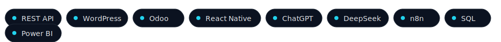

<!--
This repository must be named exactly your GitHub username: sabbam/sabbam
-->

  

<h1 align="center">Hi, I'm Sabbam Chandraneel 👋</h1>

  
  
  
  

  

---

## 🧰 Tech Stack (curated)

  

  

---

## 🚀 Snapshot
- 🔭 Building: **AI-enabled apps, WordPress platforms, and SaaS backends**
- 🏗️ ERP: **8+ Odoo modules** (commission, vendor signup, email verify, PWA, multi-company rules)
- 🌩️ Cloud: **Firebase (Auth, Firestore, Functions)**, AWS (EC2/S3), Vercel, CI/CD (GitHub Actions)
- 📦 Backends: **Node.js/Express**, REST APIs, SQL/NoSQL
- 🎯 Focus: **Production-grade quality, performance, security**
- 🧑‍🏫 Trainer: mentored **50+ learners** (full-stack & cloud)

---

## 📌 Featured Projects — Grid View
<table width="100%">
  <tr>
    <td width="50%" style="vertical-align:top;padding:12px;">
      

        <h3 style="margin:0 0 6px 0;">Digisoft AI (WordPress)</h3>
        
Corporate SEO-first build, caching/CDN, CWV optimization.

        
Stack: WordPress, custom plugins/themes, WP-CLI, CI/CD

        <a href="https://digisoftai.com/">🔗 digisoftai.com</a>
      

    </td>
    <td width="50%" style="vertical-align:top;padding:12px;">
      

        <h3 style="margin:0 0 6px 0;">IntellifluxAI (WordPress)</h3>
        
Responsive IA, fast TTFB, optimized assets & images.

        
Stack: WordPress, Gutenberg, Perf/SEO, Cloudflare

        <a href="https://intellifluxai.com/">🔗 intellifluxai.com</a>
      

    </td>
  </tr>
  <tr>
    <td width="50%" style="vertical-align:top;padding:12px;">
      

        <h3 style="margin:0 0 6px 0;">Vizag IAS Academy (WordPress)</h3>
        
Academic portal with growth-ready content model.

        
Stack: WordPress, Woo, Multisite-ready, SEO

        <a href="https://vizagiasacademy.com/">🔗 vizagiasacademy.com</a>
      

    </td>
    <td width="50%" style="vertical-align:top;padding:12px;">
      

        <h3 style="margin:0 0 6px 0;">Kaalishakthi Peetham (WordPress)</h3>
        
Events & donations with uptime-first rollout.

        
Stack: WordPress, Woo, Payment, Security Hardening

        <a href="https://kaalishakthipeetham.com/">🔗 kaalishakthipeetham.com</a>
      

    </td>
  </tr>
  <tr>
    <td width="50%" style="vertical-align:top;padding:12px;">
      

        <h3 style="margin:0 0 6px 0;">Perhit Siksha (WordPress)</h3>
        
Education nonprofit platform with structured content & SEO.

        
Stack: WordPress, Custom Theme, SEO Audits

        <a href="https://perhitsiksha.org/">🔗 perhitsiksha.org</a>
      

    </td>
    <td width="50%" style="vertical-align:top;padding:12px;">
      

        <h3 style="margin:0 0 6px 0;">AI Finance Manager</h3>
        
Predictive expense tracking.

        
Stack: Expo/React Native, Firebase, Python ML

        Repo: make public & pin
      

    </td>
  </tr>
  <tr>
    <td width="50%" style="vertical-align:top;padding:12px;">
      

        <h3 style="margin:0 0 6px 0;">AI Travel Planner</h3>
        
Personalized itineraries using GenAI.

        
Stack: React/Next.js, Firebase, OpenAI

        Repo: make public & pin
      

    </td>
    <td width="50%" style="vertical-align:top;padding:12px;">
      

        <h3 style="margin:0 0 6px 0;">AI EdTech Platform</h3>
        
Adaptive learning + analytics + GenAI.

        
Stack: Next.js, Tailwind, Firebase, GenAI

        Repo: make public & pin
      

    </td>
  </tr>
  <tr>
    <td width="50%" style="vertical-align:top;padding:12px;">
      

        <h3 style="margin:0 0 6px 0;">Odoo ERP Modules (Suite)</h3>
        
Commission, Vendor Signup, Email Verify, PWA, Multi-Company Controls.

        
Stack: Odoo (Python), PostgreSQL, Integrations

        Repo: publish suite overview & pin
      

    </td>
    <td width="50%" style="vertical-align:top;padding:12px;">
      

        <h3 style="margin:0 0 6px 0;">WCM Ministry App</h3>
        
Content + events + notifications.

        
Stack: Flutter, Firebase

        Repo: add screenshots & pin
      

    </td>
  </tr>
</table>

---

## 📊 Live Metrics (resilient)
<!-- Use <picture> to show dynamic image, fallback to local SVG -->

  <picture>
    <source srcset="https://github-readme-stats.vercel.app/api?username=sabbam&show_icons=true&hide_border=true" />
    
  </picture>

  

  <picture>
    <source srcset="https://github-profile-trophy.vercel.app/?username=sabbam&theme=flat&column=6" />
    
  </picture>

  

---

## 🧭 Quick Links
- 📄 **Resume:** [Sabbam Chandraneel.pdf](https://github.com/sabbam/sabbam/releases/latest)
- 🌐 **Portfolio:** https://neelportfolio.in

Timezone: Asia/Kolkata. Auto-generated & maintained via GitHub Actions. Last updated: 2025-08-24.
